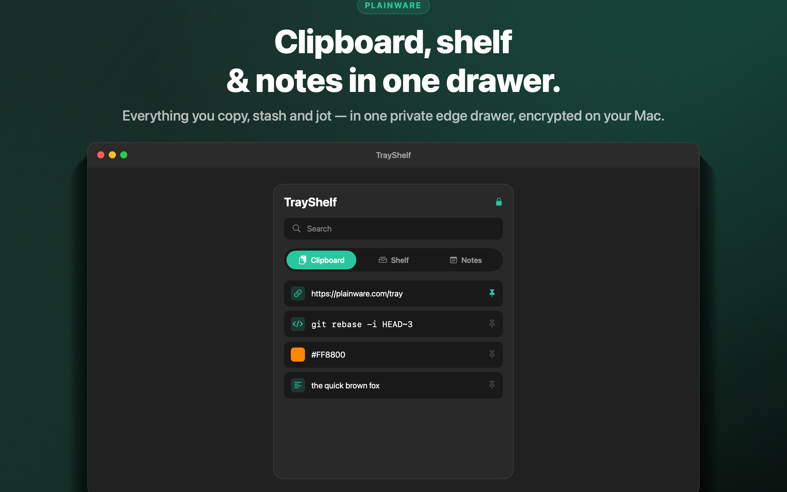
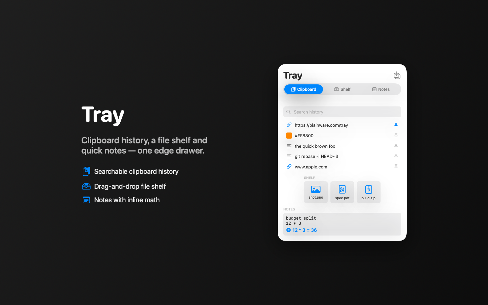
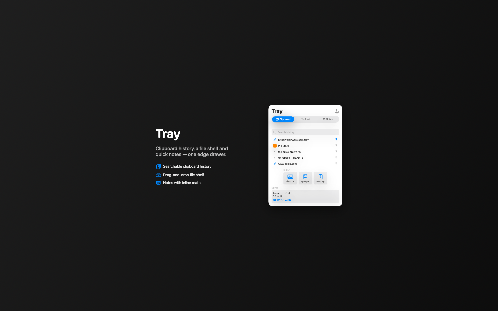

<div align="center">

# TrayShelf

### Clipboard history, a file shelf and quick notes — one edge drawer.

Pull out a drawer from the edge of your screen and get three panes in one place: a searchable **clipboard history** (with kind icons + pin), a drag-in/drag-out **file shelf**, and **quick notes** with inline calculation. Everything is classified and stored **100% locally**, encrypted at rest. Free & open source.

A free, native macOS utility drawer for the things you keep reaching for.



</div>

> The screenshots below are generated by TrayShelf itself (`swift run TrayChecks docs/images`). To use your own, drop PNGs into `docs/images/` and update the links.

---

## What it does

| | |
|---|---|
|  |  |
| **Clipboard history** with kind icons + pin, plus a mini **shelf** and **notes** preview | **One edge drawer** — clipboard, shelf and notes in a single panel |

---

## Capabilities

| Area | Features |
|---|---|
| **Clipboard** | **Auto-capture** — turn it on and everything you copy lands in history automatically (toggle in the header, remembered across launches); or capture on demand · searchable history · kind icons (text / url / color / image) · **pin** favourites to the top · delete single clips or **clear unpinned** · de-dupes consecutive identical copies · click a clip to put it back on the pasteboard, **verbatim** (newlines and indentation preserved) |
| **Private mode** | Set a **passcode** and TrayShelf masks every clip to a couple of characters until you unlock — "enter passcode to view." The passcode is stored only as a salted **PBKDF2-HMAC-SHA256** hash in the macOS Keychain (never in plaintext) |
| **Encrypted at rest** | History persists across launches as an **AES-GCM encrypted** file; the key lives in the Keychain, so the on-disk store is ciphertext, not a readable dump |
| **Sensitive-data aware** | Items flagged concealed/transient by password managers (the `org.nspasteboard.*` convention + a default ignore list incl. 1Password) are **never recorded** |
| **File shelf** | **Drag files in** to park them · drag them back **out** to any app · per-type icons (image, pdf, archive, video, audio, text…) · remove with one click |
| **Quick notes** | A monospaced scratchpad with **inline calculation** — type `12 * 3` (or `(2+2)/4`) and TrayShelf evaluates the last line live |
| **Classification** | Each clip is classified as **text**, **url**, **color** (`#RGB` / `#RRGGBB`) or **image** for the right icon and behaviour |
| **Trust** | 100% local — clips, files and notes never leave your Mac · no telemetry in the shipped build · no account |

> **No synthetic paste.** TrayShelf never injects keystrokes into other apps. Clicking a clip copies it back to the system pasteboard; **you press ⌘V yourself** to paste. This keeps TrayShelf within the App Sandbox and out of your other apps' input.

---

## Security & privacy

Your clipboard is sensitive — TrayShelf treats it that way.

- **Encrypted at rest.** History is persisted to your sandbox container as a single **AES-GCM (256-bit)** file (`Application Support/Tray/history.enc`). On disk it is authenticated ciphertext — not a readable dump, even to other tools on the same Mac.
- **Key in the Keychain.** The data-encryption key is generated on first use and stored in the **macOS Keychain** (`kSecAttrAccessibleAfterFirstUnlockThisDeviceOnly`, never synced). It is never written next to the data and never leaves the device.
  - **Why macOS asks for permission:** the first time TrayShelf stores or reads that key, macOS may show a Keychain prompt. Choose **“Always Allow.”** That's macOS doing its job — gating access to TrayShelf's encryption key. (In a properly signed release this is a one-time prompt; during local development each re-signed build can re-prompt.)
- **Private mode (lock/unlock).** Set a passcode from the **lock menu** in the header (or anytime later) and TrayShelf masks every clip to a couple of characters — *“enter passcode to view.”* Click the lock to re-lock; unlock from the banner or lock button. The passcode is stored **only** as `PBKDF2-HMAC-SHA256` (120k iterations, 16-byte random salt) in the Keychain — never in plaintext, and unrecoverable if forgotten.
- **Password managers respected.** Items flagged concealed/transient (the `org.nspasteboard.{Concealed,Transient,AutoGenerated}Type` convention plus a default ignore list — 1Password, KeeWeb, TextExpander, Handoff, …) are **never recorded**.
- **On-device only.** Clips, files and notes never leave your Mac. No account, no analytics in the shipped build. The single network call is an anonymous version check (see [`docs/PRIVACY.md`](docs/PRIVACY.md)).

> **Threat model, honestly:** the passcode protects against casual/over-the-shoulder access while TrayShelf is open; the at-rest encryption protects the stored file. The passcode does **not** derive the encryption key, so someone with full access to your *unlocked* Mac and Keychain could still read history — the same trust boundary every local clipboard manager has. Full details and how to report issues: [`SECURITY.md`](SECURITY.md).

---

## Architecture

TrayShelf is a native SwiftUI macOS app that builds entirely from source. (The internal Swift package name is `Tray`.)

```
Sources/Tray         executable (@main)   — app entry, menus, settings, logging bootstrap
Sources/TrayUI       library              — drawer UI + view model
Engines/DrawerEngine library              — clipboard/shelf/notes core: clip classification, inline calc, clipboard store, AES-GCM encrypted persistence + Keychain-backed passcode/vault
Packages/Core        shared modules       — DesignSystem, CommonUI, RemoteConfigKit, LicenseKit, UpdateKit, LogKit, ScreenshotKit
```

- **No synthetic paste:** the engine and view model only read/write the pasteboard; TrayShelf never synthesizes a ⌘V keystroke into other apps — you paste yourself.
- **Feature flags** (paid features, in-app updates, force-update) are built but **gated OFF** via Firebase Remote Config (`RemoteConfigKit`) and flipped on later with no app update. `GoogleService-Info.plist` is **not** committed — drop your own into the project root if you wire up Firebase; the app runs fine without it.
- **Logging**: every run writes to `~/Library/Containers/com.plainware.tray/Data/Library/Logs/Plainware/Tray.log` (sandboxed) — `tail -f` it to debug.

## Build & run (no Xcode required)

```bash
Scripts/bundle.sh --package-dir . --product Tray --name TrayShelf \
  --bundle-id com.plainware.tray --info-plist Resources/Info.plist \
  --entitlements Resources/Tray.entitlements --icon Resources/AppIcon.icns --open
```

Run the test suite + regenerate gallery / App Store screenshots (off-screen, no permissions):

```bash
swift run TrayChecks docs/images
```

## Engine API (`DrawerEngine`)

The `DrawerEngine` module is the clipboard/shelf/notes core + AES-GCM vault, and builds from source like the rest of the app.

```swift
enum ClipKind: String, Sendable { case text, url, color, image }
struct ClipItem: Identifiable, Sendable { id; kind; text; date; pinned }

func classify(_ s: String) -> ClipKind          // URL / hex color / text
func evaluateInline(_ line: String) -> String?   // "12*3" -> "36", "hello" -> nil

@MainActor final class ClipboardStore: ObservableObject {
    @Published var items: [ClipItem]
    func add(_ text: String)        // classifies + de-dupes consecutive
    func search(_ q: String) -> [ClipItem]
    func togglePin(_ id: UUID)
}
```

## License

Licensed under the GNU Affero General Public License v3.0 (AGPL-3.0) — see [LICENSE](LICENSE). © 2026 Prakhar Gupta.
